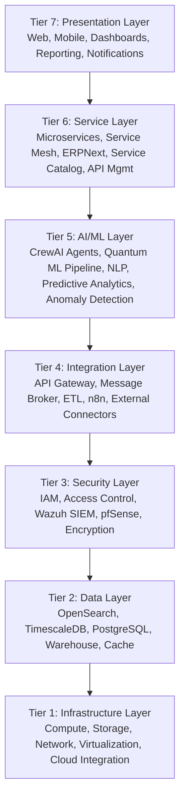
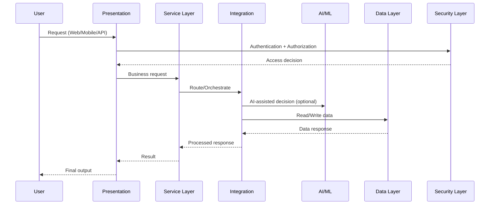

# KUBRICXE + KUBRICAI  
## Complete Production Architecture (FYP)

**Repository:** `students-TCP-NINJA/Kubric-FYP`  
**Version:** 1.0  
**Date:** 2026-04-23

---

## 1. Executive Overview

Kubric is a unified enterprise architecture that combines:

- **SOC** (Security Operations Center)
- **NOC** (Network Operations Center)
- **AI Orchestration** (CrewAI + Quantum ML pipeline)
- **Service Operations** (ITIL 4-aligned)

The architecture follows a **7-tier layered model** to ensure scalability, maintainability, resilience, and governance.

---

## 2. 7-Tier Architecture (Logical View)

---

## 3. Design Principles

1. **Defense in Depth**  
   Security controls exist at every layer.

2. **Separation of Concerns**  
   Each tier has clear responsibilities and interfaces.

3. **Automation-First**  
   n8n, IaC, and AI agents reduce manual operations.

4. **Observability by Design**  
   Logs, metrics, traces, and alerts are built-in.

5. **ITIL 4 Alignment**  
   Value, iteration, collaboration, and continual improvement are embedded.

---

## 4. Core Capability Domains

- **SOC:** EDR, ITDR, NDR, XDR, CDR, SDR
- **NOC:** Device monitoring, traffic analytics, incident response
- **Service Management:** Incident, problem, change, request, service desk
- **AI Operations:** Agent orchestration, predictive analytics, anomaly detection
- **Governance:** Compliance, risk management, auditability

---

## 5. Data and Control Flow (High-Level)

---

## 6. Non-Functional Targets

- **Availability:** 99.9%+ (target)
- **Security:** Zero-trust principles, encrypted in transit and at rest
- **Scalability:** Horizontal scaling for services, brokers, and data tiers
- **Recovery:** Defined RTO/RPO and backup/recovery workflows
- **Performance:** Real-time operations for SOC/NOC monitoring

---

## 7. Document Map

See `docs/00-INDEX.md` for complete documentation navigation.
