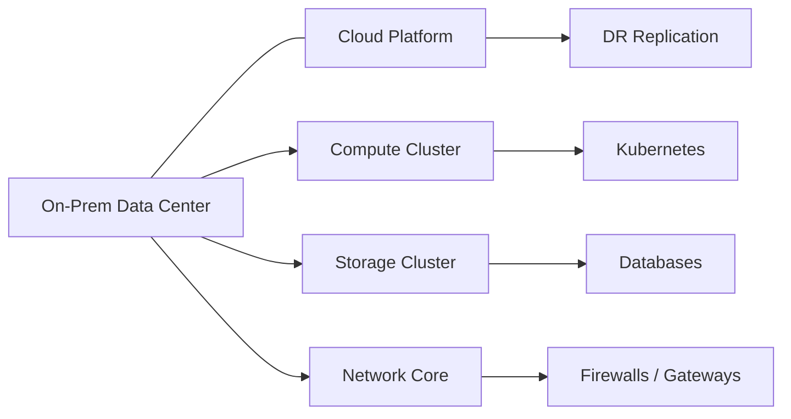

# Tier 1: Infrastructure Layer

## 1. Purpose

This layer provides the base runtime platform for all upper layers:
- Compute
- Storage
- Network
- Virtualization
- Hybrid/Cloud integration

---

## 2. Infrastructure Components

## 2.1 Compute Resources
- Physical and virtual compute pools
- Container runtime hosts for Kubernetes workloads
- Resource quotas and overcommit policy

## 2.2 Storage Systems
- High-performance SSD/NVMe tier for critical workloads
- Standard block/object storage for general workloads
- Archive tier for retention and compliance

## 2.3 Network Infrastructure
- Segmented VLAN design
- East-west and north-south traffic controls
- Redundant routing and firewall boundaries

## 2.4 Virtualization Platform
- Hypervisor clusters for VM-based services
- Kubernetes cluster for microservices and AI workloads
- Autoscaling worker pools

## 2.5 Cloud Integration
- Hybrid model (on-prem + cloud)
- Cloud burst for demand spikes
- Backup/DR storage replication

---

## 3. Logical Topology

---

## 4. Availability and Resilience

- N+1 capacity for critical clusters
- Dual network paths
- Storage replication
- Scheduled backup and restore tests
- Cluster health checks + automated failover

---

## 5. Security Controls at Infrastructure

- Hardened OS baseline
- Host-based EDR agents
- Network ACLs and segmentation
- Secrets management (no plaintext credentials)
- Centralized audit logging

---

## 6. Operational Standards

- IaC provisioning preferred
- Change managed through approved workflows
- Patch windows + emergency patch process
- Capacity planning monthly review

---

## 7. KPIs

- Infrastructure uptime %
- CPU/Memory utilization trends
- Storage latency and throughput
- Packet loss and link utilization
- Backup success rate
