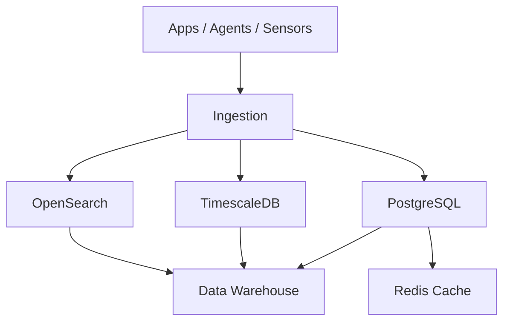

# Tier 2: Data Layer

## 1. Purpose

The data layer stores and serves operational, analytical, and historical data across Kubric services.

---

## 2. Data Platform Components

## 2.1 OpenSearch
- Log search, observability, SOC analytics
- Full-text indexing + alert support

## 2.2 TimescaleDB
- High-volume time-series metrics
- NOC/SOC telemetry retention

## 2.3 PostgreSQL
- Core transactional data
- Service and operations records

## 2.4 Data Warehouse
- Aggregated analytics
- BI/reporting datasets

## 2.5 Cache Layer (Redis)
- Low-latency access for hot data
- Session/token/cache workloads

---

## 3. Data Flow

---

## 4. Data Governance

- Data classification (public/internal/confidential/restricted)
- Role-based data access
- Retention and archival policies
- Audit trails for critical data changes
- Encryption at rest and in transit

---

## 5. Reliability Patterns

- Replication for critical databases
- Point-in-time recovery capability
- Backup verification and restore drills
- Read/write separation where needed
- Query optimization and indexing strategy

---

## 6. KPIs

- Query response time (p95)
- Replication lag
- Backup success/failure rate
- Cache hit ratio
- Indexing latency
