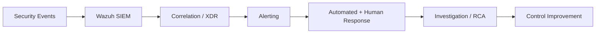

# Tier 3: Security Layer

## 1. Purpose

Provides centralized protection, detection, response, and governance across all Kubric tiers.

---

## 2. Core Security Components

## 2.1 Identity Management (IAM)
- Centralized identity provider
- SSO + MFA
- User lifecycle (join/move/leave)

## 2.2 Access Control
- RBAC with least privilege
- Just-in-time elevation (where applicable)
- Periodic access reviews

## 2.3 Wazuh SIEM
- Security log aggregation
- Detection rules and correlation
- Compliance and audit support

## 2.4 pfSense Firewall
- Boundary filtering and segmentation enforcement
- VPN and remote-access policy controls

## 2.5 Encryption Services
- TLS/mTLS for in-transit data
- At-rest encryption across storage and database layers

---

## 3. SOC Domains (Integrated)

- **EDR**: Endpoint behavior and malware detection
- **ITDR**: Identity misuse and account takeover detection
- **NDR**: Network-level anomaly and threat detection
- **XDR**: Cross-domain correlation and coordinated response
- **CDR**: Cloud activity and posture monitoring
- **SDR**: SaaS threat and access monitoring

---

## 4. Security Operations Flow

---

## 5. Security Controls by Priority

1. Identity-first controls (MFA/SSO/RBAC)
2. Network segmentation and least trust
3. Endpoint telemetry + response automation
4. Centralized detection and alert routing
5. Incident response playbooks and post-incident review

---

## 6. KPIs

- MTTD (Mean Time to Detect)
- MTTR (Mean Time to Respond)
- High-severity incident count
- False-positive rate
- Patch compliance %
