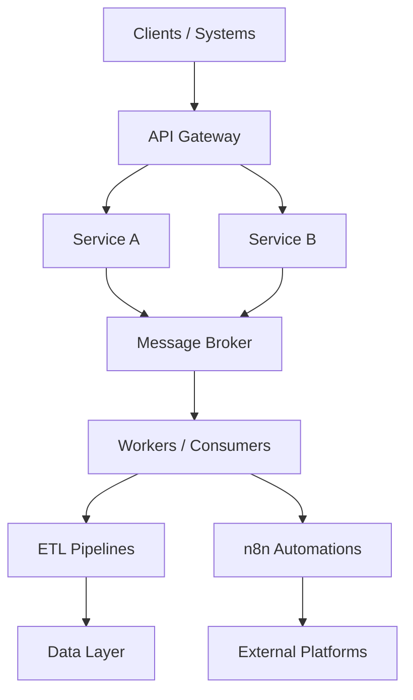

# Tier 4: Integration Layer

## 1. Purpose

Connects services, tools, and external platforms through APIs, events, and automation workflows.

---

## 2. Components

## 2.1 API Gateway
- Authentication, routing, throttling, and policy enforcement
- Unified entry point for internal/external APIs

## 2.2 Message Broker
- Async communication
- Event-driven integration patterns

## 2.3 ETL Pipeline
- Data extraction, transformation, and loading
- Scheduled and incremental data flows

## 2.4 n8n Automation
- Workflow orchestration for operational tasks
- Integrations with service desk, alerts, and external apps

## 2.5 External Connectors
- SaaS, cloud, and enterprise integrations
- Controlled through secure credentials/secrets

---

## 3. Integration Patterns

- Request/Response (synchronous)
- Publish/Subscribe (asynchronous)
- Batch transfer
- Event streaming

---

## 4. High-Level Integration Flow

---

## 5. Security and Reliability

- OAuth2/JWT for API auth
- Retry and dead-letter queue patterns
- Idempotency for critical workflows
- Timeout/circuit-breaker protection
- End-to-end trace IDs

---

## 6. KPIs

- API p95 latency
- Error rate per endpoint
- Message processing lag
- Workflow success rate
- Connector uptime
