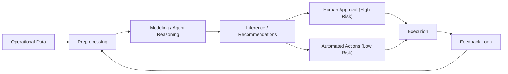

# Tier 5: AI/ML Layer

## 1. Purpose

The AI/ML layer delivers intelligent automation, prediction, anomaly detection, and agent-driven orchestration for Kubric operations.

---

## 2. Core Components

## 2.1 CrewAI Agents
- Multi-agent execution model
- Role-based agents (Analyst, Responder, Planner, Communicator)
- Task chaining and delegation
- Human approval for high-risk actions

## 2.2 Quantum ML Pipeline
- Next-generation ML lifecycle abstraction
- Data prep, training, evaluation, deployment
- Supports experimentation and versioned rollouts

## 2.3 NLP Services
- Text classification (tickets/logs/messages)
- Summarization for incidents and reports
- Entity extraction for RCA and threat intelligence

## 2.4 Predictive Analytics
- Capacity forecasting
- Incident probability scoring
- SLA breach prediction

## 2.5 Anomaly Detection
- Behavioral baselining
- Drift detection
- Alert correlation assistance

---

## 3. AI Workflow (High-Level)

---

## 4. Governance and Safety

- Model versioning and rollback
- Prompt/agent action auditing
- Human-in-the-loop policy gates
- Confidence thresholds before autonomous execution
- Bias and drift monitoring

---

## 5. KPIs

- Prediction accuracy %
- False alert reduction %
- Time saved via automation
- AI-assisted resolution rate
- Drift detection frequency
