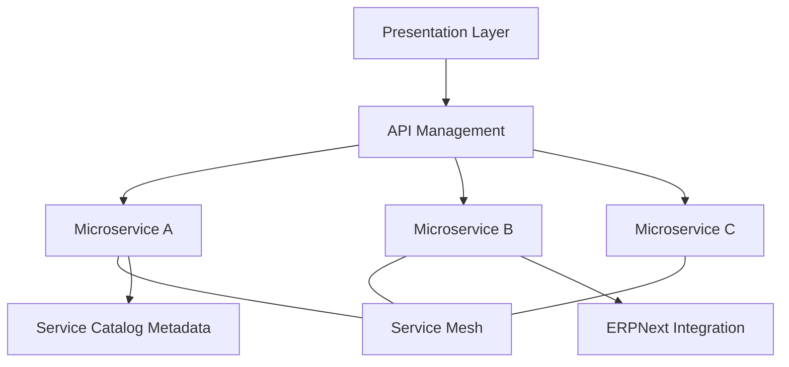

# Tier 6: Service Layer

## 1. Purpose

The service layer exposes business capabilities through composable services and APIs.

---

## 2. Components

## 2.1 Microservices Architecture
- Domain-based services
- Independent deployment
- Bounded context ownership
- Fault isolation between services

## 2.2 Service Mesh
- East-west traffic control
- mTLS between services
- Retries, timeouts, circuit breakers
- Service-level telemetry

## 2.3 ERPNext Integration
- Financial and operational process alignment
- Service-cost visibility
- Asset/process synchronization

## 2.4 Service Catalog
- Discoverable list of available services
- Ownership, SLA, dependencies
- Consumer onboarding data

## 2.5 API Management
- API lifecycle control
- Documentation and versioning
- Access policy and quotas

---

## 3. Service Interaction Model

---

## 4. Reliability Standards

- Health checks and readiness probes
- Canary/blue-green deployment support
- Retry/backoff patterns
- Idempotent critical operations
- Dependency timeout budgets

---

## 5. KPIs

- Service availability %
- API success rate %
- Deployment success rate
- p95 service latency
- Change failure rate
