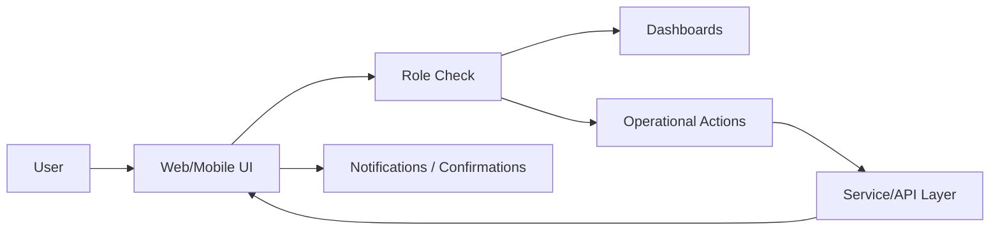

# Tier 7: Presentation Layer

## 1. Purpose

Provides user-facing experiences for operations, management, reporting, and response actions across web and mobile channels.

---

## 2. Components

## 2.1 Web Interface
- Responsive portal for operations teams
- Role-based dashboards
- Real-time status and controls

## 2.2 Mobile Applications
- Incident and alert triage on-the-go
- Push notifications and escalations
- Secure login with MFA

## 2.3 Dashboard Framework
- Widget-based customizable dashboards
- Team-specific operational views
- Drill-down analytics

## 2.4 Reporting Engine
- Scheduled and on-demand reporting
- Executive, compliance, operational reports
- Export formats (PDF/CSV/XLSX)

## 2.5 Notification System
- Email/SMS/In-app channels
- Priority and escalation policies
- Delivery tracking

---

## 3. UX Flow (Simplified)

---

## 4. Design Principles

- Keep it simple and practical
- Accessibility and readability first
- Role-focused information density
- Fast path for urgent actions
- Minimal clicks for critical workflows

---

## 5. KPIs

- Time to complete common tasks
- User satisfaction score
- Notification delivery success %
- Dashboard load time
- Mobile action completion rate
