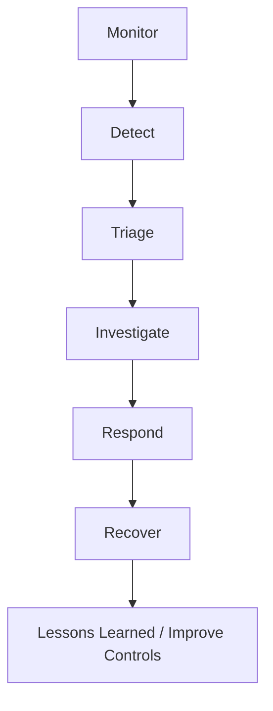

# SOC Operations

## 1. Purpose

SOC monitors, detects, investigates, and responds to security threats across endpoints, identities, network, cloud, and SaaS environments.

---

## 2. SOC Capability Stack

- **EDR:** Endpoint telemetry and response
- **ITDR:** Identity misuse and account compromise detection
- **NDR:** Network behavior and threat monitoring
- **XDR:** Cross-domain threat correlation
- **CDR:** Cloud threat and posture response
- **SDR:** SaaS threat detection and access anomaly response

---

## 3. SOC Process Lifecycle

---

## 4. Incident Severity Model

- **Critical:** Active compromise/service impact (immediate response)
- **High:** Confirmed threat with potential spread
- **Medium:** Suspicious pattern requiring investigation
- **Low:** Informational security event

---

## 5. Response Playbook Elements

- Trigger conditions
- Containment steps
- Communication templates
- Escalation rules
- Recovery validation
- Evidence handling and post-incident report

---

## 6. SOC KPIs

- MTTD / MTTR
- Escalation accuracy
- Containment time
- Reopened security incidents
- Rule precision/false positive rate
