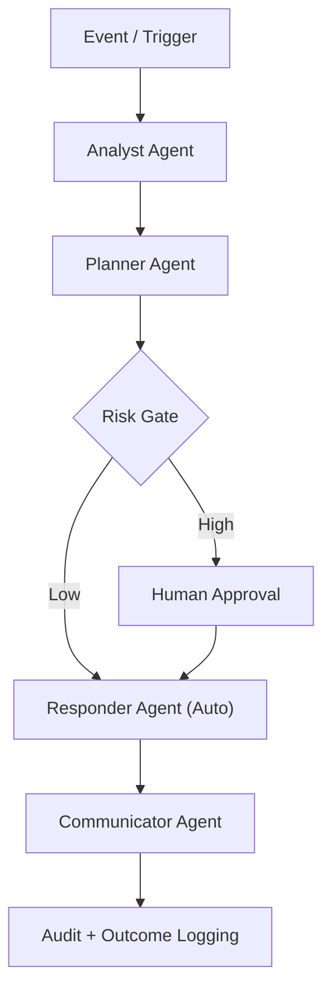

# AI Orchestration

## 1. Purpose

AI orchestration coordinates autonomous and semi-autonomous workflows using agent collaboration, model inference, and governed action execution.

---

## 2. Multi-Agent Roles

- **Analyst Agent:** Pattern analysis, summarization, risk scoring
- **Responder Agent:** Executes approved response tasks
- **Planner Agent:** Recommends next best actions
- **Communicator Agent:** Produces stakeholder updates and reports

---

## 3. Orchestration Control Flow

---

## 4. Guardrails

- Risk-based autonomy limits
- Mandatory approvals for destructive actions
- Immutable audit logs of agent decisions
- Action timeout and rollback policies
- Human override capability at all times

---

## 5. Use Cases

- Alert triage acceleration
- Automated incident enrichment
- Drafting change plans
- SLA breach prevention recommendations
- Proactive capacity warnings

---

## 6. KPIs

- Automation success rate
- Human override frequency
- Time-to-triage improvement
- Recommendation acceptance rate
- Incident closure acceleration
