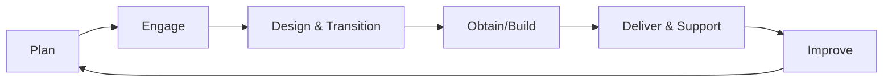

# Service Operations (ITIL 4 Aligned)

## 1. Purpose

Defines operational practices for delivering reliable IT services with clear ownership, workflows, and continual improvement.

---

## 2. Operational Practices

## 2.1 Service Desk
- Single point of contact
- Multi-channel intake (portal, email, chat)
- SLA-driven handling and updates

## 2.2 Incident Management
- Rapid restoration of service
- Severity-based escalation
- Communication cadence for major incidents

## 2.3 Problem Management
- Root cause analysis
- Known error records
- Preventive action tracking

## 2.4 Change Management
- Standard, normal, emergency changes
- Risk assessment and approvals
- Controlled deployment and rollback

## 2.5 Request Fulfillment
- Structured service requests
- Workflow automation for common requests
- Approval and audit traceability

---

## 3. Service Value Chain Alignment

---

## 4. Operating Model Controls

- RACI ownership per service
- SLA/OLA definitions
- Runbooks and knowledge articles
- Shift handover standards
- Post-incident and post-change reviews

---

## 5. KPIs

- SLA compliance %
- First response time
- First contact resolution rate
- Change success rate
- Problem recurrence rate
