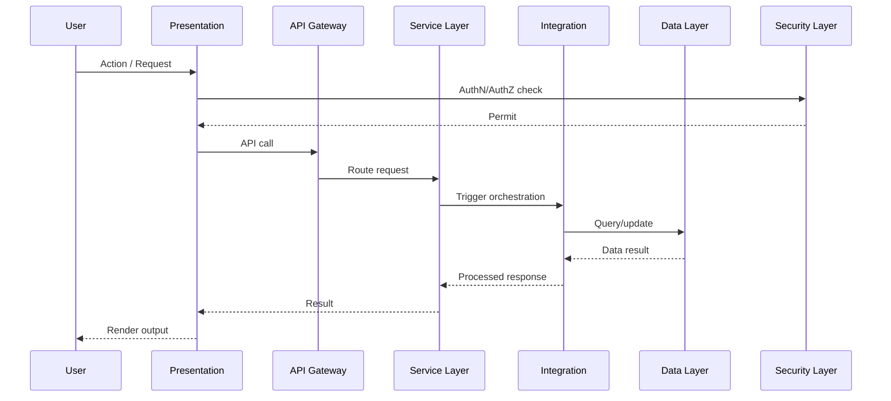
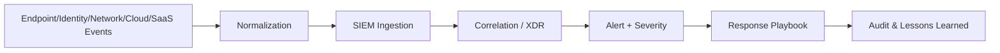

# Data Flows

## 1. Purpose

Defines end-to-end data movement across Kubric tiers for operations, security, analytics, and reporting.

---

## 2. Primary Flow Types

1. **User interaction flow** (UI → Services → Data)
2. **Telemetry flow** (agents/sensors → analytics stores)
3. **Security event flow** (detections → SIEM/XDR → response)
4. **Service workflow flow** (requests/incidents/changes)
5. **Reporting flow** (operational stores → warehouse → dashboards)

---

## 3. End-to-End Request Flow

---

## 4. Security Event Flow

---

## 5. Data Quality and Control Points

- Schema validation on ingestion
- Deduplication for repeated events
- Timestamp normalization (UTC)
- Critical field completeness checks
- Reconciliation between sources and warehouse

---

## 6. Flow KPIs

- Pipeline latency
- Event ingestion success %
- Data freshness lag
- Correlation delay
- Failed flow retry success rate
