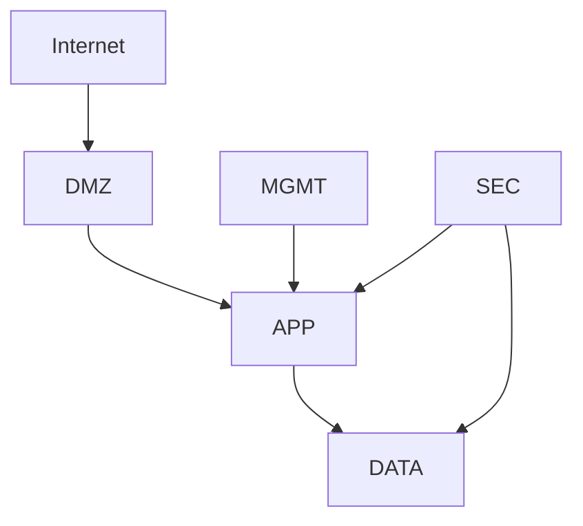

# Security Architecture

## 1. Purpose

Describes the enterprise security blueprint supporting zero-trust operations and defense-in-depth across Kubric.

---

## 2. Security Model

## 2.1 Defense in Depth Layers
- Identity controls
- Network segmentation
- Endpoint protection
- Application/API security
- Data protection
- Monitoring and response

## 2.2 Zero-Trust Principles
- Never trust, always verify
- Least privilege everywhere
- Continuous verification
- Assume breach and contain quickly

---

## 3. Security Zones

- **DMZ:** public ingress endpoints
- **Application zone:** service runtime
- **Data zone:** databases and storage
- **Management zone:** administrative tooling
- **Security zone:** SIEM/XDR/SOC tooling

---

## 4. Core Security Controls

- IAM + MFA + SSO
- RBAC and conditional access
- mTLS/TLS for service and API traffic
- EDR and host hardening
- WAF/firewall policies
- SIEM central logging + alerting
- Immutable audit logs

---

## 5. Incident Response Architecture

- Detection pipelines
- Alert severity routing
- Automated containment options
- Forensic evidence preservation
- Recovery + post-incident review

---

## 6. Security KPIs

- Critical vuln remediation time
- Privileged access review compliance
- Detection-to-containment time
- Unauthorized access attempts blocked
- Security control coverage %
