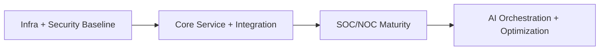

# Implementation Roadmap

## 1. Purpose

Phased rollout plan to deliver Kubric architecture incrementally with controlled risk and measurable value.

---

## 2. Phase Plan

## Phase 1: Foundation (Months 1–3)
- Infrastructure baseline
- Core security controls (IAM, firewall, SIEM foundation)
- Monitoring setup (logs/metrics)
- Initial service desk setup

**Exit Criteria**
- Tier 1+2 operational
- Core auth and segmentation active
- Baseline observability running

---

## Phase 2: Core Services (Months 4–6)
- Service layer deployment
- Integration layer enablement (API gateway, broker, n8n)
- SOC + NOC basic operations
- Initial dashboards and reporting

**Exit Criteria**
- Tier 3+4+6 functioning
- Critical service workflows live
- Incident/change flows operational

---

## Phase 3: Advanced Capabilities (Months 7–9)
- AI/ML orchestration enablement
- Predictive analytics and anomaly models
- Expanded SOC/NOC automation
- Governance and compliance refinement

**Exit Criteria**
- Tier 5 operational
- Automated response playbooks in production
- KPI and SLA reporting stabilized

---

## 3. Milestone Dependencies

---

## 4. Risk Management

- Rollback plans per release
- Environment promotion gates
- Change advisory checkpoints
- Capacity and security pre-checks
- Disaster recovery drills per phase

---

## 5. Governance Cadence

- Weekly implementation standup
- Bi-weekly architecture review
- Monthly steering committee
- Quarterly control/compliance review
