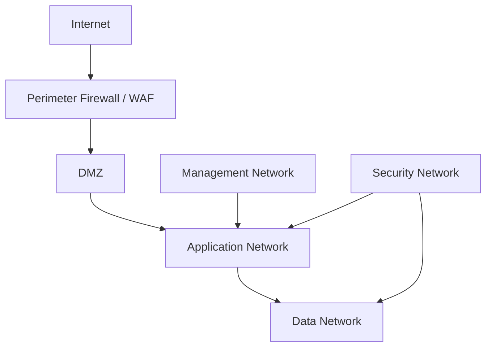

# Network Topology

## 1. Purpose

Defines logical and operational network design for secure and resilient Kubric operations.

---

## 2. Logical Segments

- **DMZ Segment**
- **Application Segment**
- **Data Segment**
- **Management Segment**
- **Security Segment**

---

## 3. High-Level Topology

---

## 4. Routing and Control

- Controlled east-west paths
- Strict north-south ingress/egress
- ACL-based segment access
- Route redundancy for critical paths
- Network telemetry exported to NOC/SOC

---

## 5. Connectivity Policies

- Only required ports/protocols opened
- Management access through approved bastions/VPN
- Service-to-service auth enforced by mesh controls
- External connectors isolated and monitored
- Deny-by-default policy baseline

---

## 6. Topology KPIs

- Link availability %
- Packet loss and jitter
- Latency across critical paths
- Segment policy violation count
- Mean time to isolate faulty path
