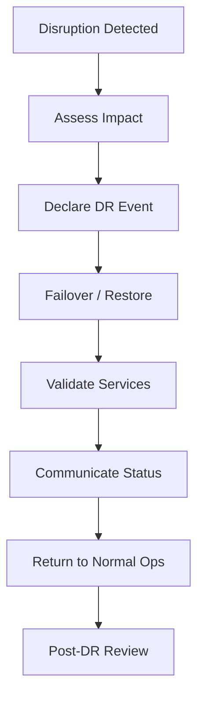

# Disaster Recovery

## 1. Purpose

Ensures Kubric can recover critical services and data within defined business continuity targets.

---

## 2. Recovery Objectives

- **RTO (Recovery Time Objective):** Target restore time per service tier
- **RPO (Recovery Point Objective):** Maximum acceptable data loss window

---

## 3. DR Strategy

- Multi-zone redundancy for critical services
- Backup replication to secondary site/cloud
- Regular restore testing and validation
- Priority restoration order based on service criticality

---

## 4. Recovery Tiers (Example)

| Service Class | RTO | RPO |
|---|---|---|
| Critical Security/Identity | 1–2 hours | < 15 min |
| Core Service APIs | 2–4 hours | < 30 min |
| Reporting/Analytics | 8–24 hours | < 4 hours |
| Archive/Non-critical | 24–72 hours | < 24 hours |

---

## 5. DR Runbook Flow

---

## 6. DR Readiness Requirements

- Backup integrity checks
- Recovery runbook ownership
- Quarterly failover drills
- Dependency mapping updates
- Executive and technical communication templates
